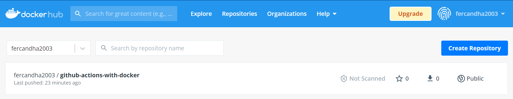
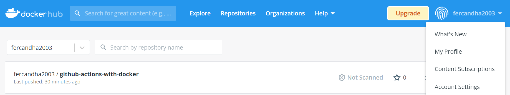
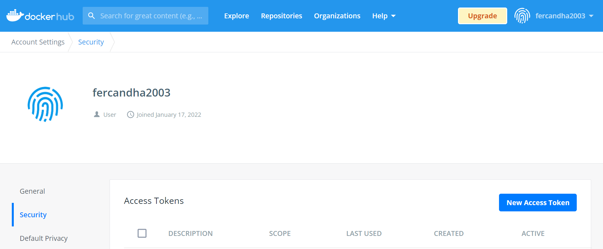
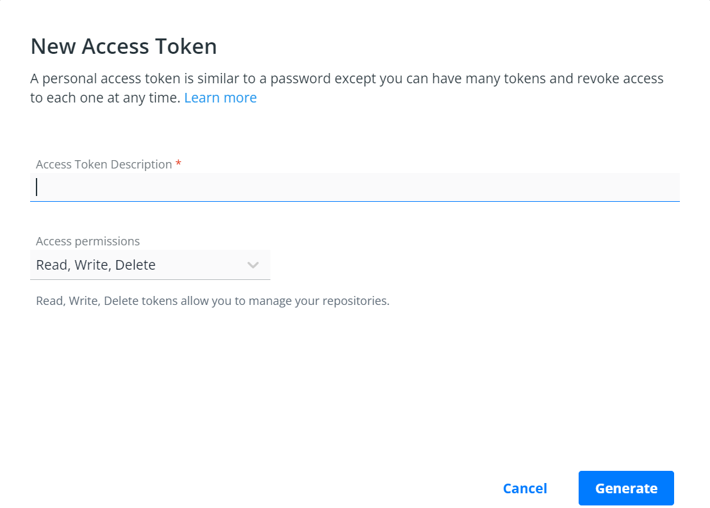

# **Github Actions - Demo**

## **Herramientas y tecnologías usadas**

- Docker Desktop Windows / Ubuntu 18.04

- Python 3.10

## **Creando carpeta de proyecto**

- Crear carpeta .github/workflows

- Crear archivo **nombre del archivo**.yml

- Definiendo la acción:

    * Nombre de la acción.

    * Evento de ejecución.

    * Definir sistema operativo.

    * Pasos.

## **Generar token de DockerHub**

- Ingresar a DockerHub

- Ir a configuración de la cuenta

- Ir a la pestaña Security

- Hacer click en __New Access Token__

Ingresar descripción y definir los permisos del Token.

## **Subir una imagen a DockerHub**

- cd path/Dockerfile folder

- docker build -t username/repository:**tagname** .

- docker push username/repository:**tagname**

## **Configurando repositorio de Github**

- Ir al repositorio

- Ir a la pestaña de configuraciones / Settings

- Ir al menú Secrets / Actions

- Crear los siguientes __Secrets__:

    - DOCKER_HUB-TOKEN

    - DOCKER_HUB_PASSWORD

    - DOCKER_HUB_NAMESPACE